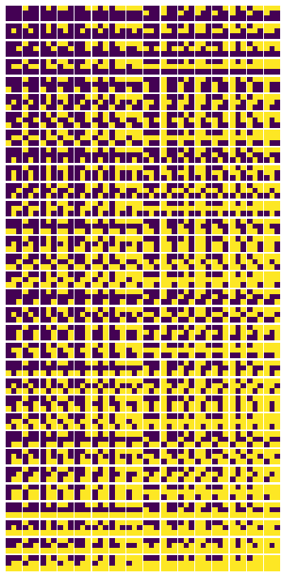

# binary-squares

inception for an art exploration. Initially sparked by the cool block letters designed for the 
[Fort Worth Museum](http://idsgn.org/posts/fort-worth-museum-gets-square/).

Visual first pass using some simple python and matplotlib:

